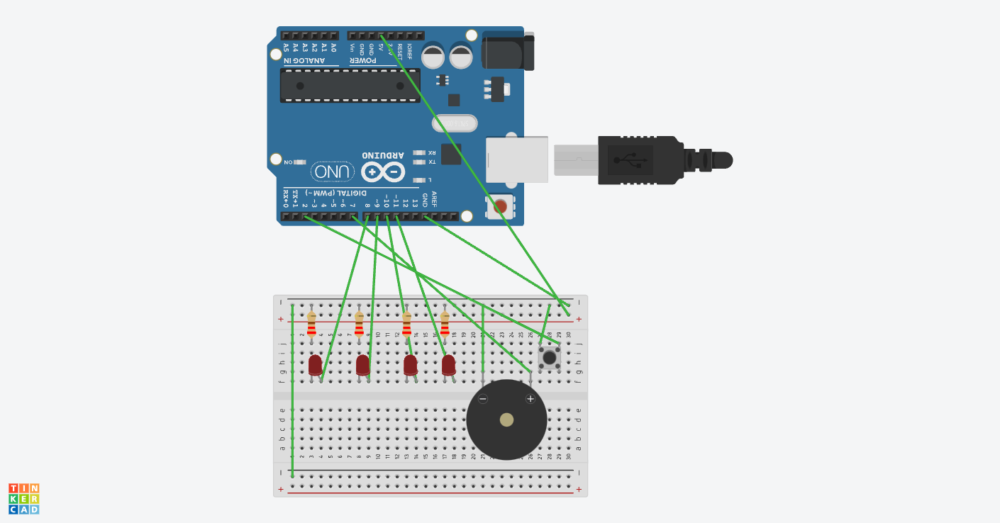

# Arduino Melody Player with LED Light Show

## Circuit Diagram


## How It Works
The sketch plays a short melody automatically, one note at a time. For each non-rest note, a randomly selected LED lights up for the duration of the note. Holding the button prevents the melody from looping and lights up a random LED.

---

## Files

| File | Description |
|------|-------------|
| `sketch_pitchtest.ino` | Main Arduino sketch — melody, LED logic, and button input |
| `pitches.h` | Frequency definitions for notes B0 through DS8 |

---

## Customizing the Melody

Edit the two arrays in `sketch_pitchtest.ino`:

```cpp
// The notes to play — use constants from pitches.h, or REST for silence
int melody[] = {
  FS5, REST, FS5, REST, FS5, REST, FS5, REST,
  A5, REST, A5, REST, B5, REST,
  B5, FS5, E5, D5, B4,
  FS5, REST, FS5, REST, FS5, REST,
  E5, REST, E5, REST, FS5, REST,
  E5, D5, B4
};

// Duration of each note: 8 = eighth note, 16 = sixteenth note
int noteDurations[] = {
  8, 8, 8, 8, 8, 8, 8, 8, 8, 16, 8, 16, 8, 8, 8, 8, 8, 8, 8, 8, 8, 8, 8, 8, 8, 8, 16, 8, 16, 8, 8, 8, 8, 8
};
```

Both arrays must be the same length.
Note duration is calculated as `1500 / value`, so an `8` gives roughly a 187ms note step.
To speed up or slow down the overall tempo, change the `1500` base number.

---

## Dependencies
No external libraries required.

---

## License
MIT — feel free to use and modify.
